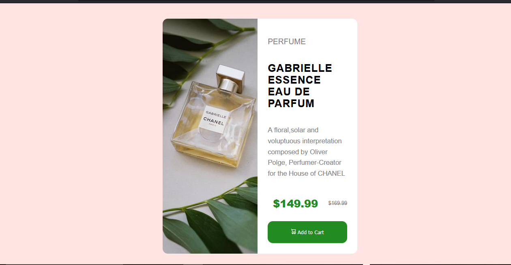

# Product Preview Card Component

Este es un proyecto realizado como parte de un desafio de [Frontend Mentor]( https://www.frontendmentor.io/challenges/product-preview-card-component-GO7UmttRfa ),donde se replica una tarjeta de producto con un diseño responsive.El objetivo
fue practicar diseño con **HTML**,**SASS(Ruby)** y **CSS Grid/Flexbox**.

## Vista previa


## Enlace al desafio

[Frontend Mentor - Product Preview Card Component](https://www.frontendmentor.io/challenges/product-preview-card-component-GO7UmttRfa)

## Enlace del proyecto ya publicado
[Puedes ver aqui mi proyecto terminado](https://parfumfresh87irhj.netlify.app/)

---

## Tecnicas y Tecnologias empleadas

- HTML5
- SASS(Ruby)
- CSS Grid y Flexbox
- Responsive Design (Mobile First)
- VS Code

## Estructura del proyecto

```bash
    index.html
    scss/
        style.scss
        _variables.scss
        _base.scss
        _layout.scss
        _components.scss
        _mixins.scss
    css/
        styles.css #Archivo compilado desde SASS
    images/
        icon-cart.svg
        image-product-desktop.jpg
    myREADME.md 
```
## Como compilar SASS (Ruby)
Este proyecto usa la version de Ruby de SASS.Para compilar los estilos:

```sass --watch scss/style.scss:css/styles.css```

Esto observara cambios y compilara automaticamente.Claro si ya tienes la gema de sass descargada del Ruby Installer.

## Lecciones aprendidas
- Como estructurar un proyecto con SASS usando archivos parciales.
- Aplicar diseño responsive usando Grid y Flexbox.
- Mejorar la semantica HTML y optimizar estilos CSS.
- Uso de 'overflow:hidden' y 'border-radius' para lograr acabados visuales mas limpios.

## Autor 
- Codificado por AbelVOrtuno
- Desafio de Frontend Mentor

## Creditos

Diseño original por Frontend Mentor.Adaptado y maquetado por mi como practica de proyectos personales.